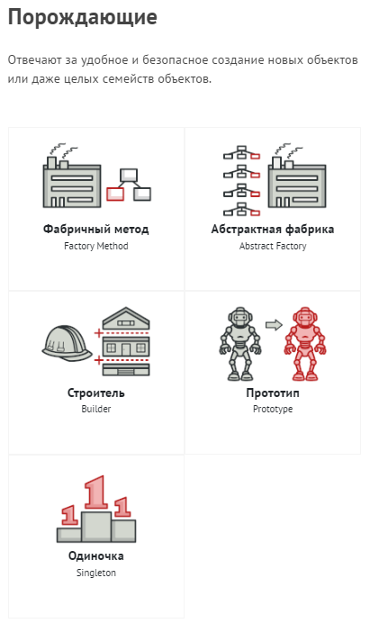
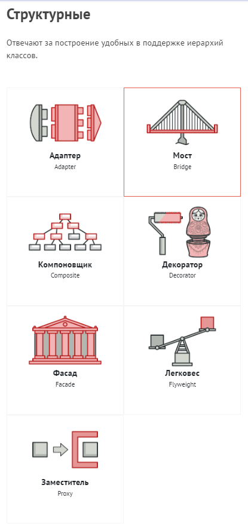
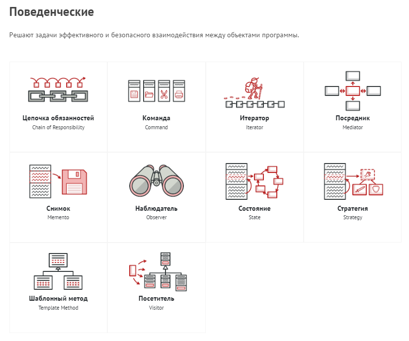

# Architecture

### Design Patterns
Паттерны (или шаблоны) проектирования описывают
типичные способы решения часто встречающихся
проблем при проектировании программ.

### Польза паттернов
Вы можете вполне успешно работать, не зная
ни одного паттерна. Но зная паттерны, вы
получаете ещё один инструмент в свой
личный набор профессионала. Паттерны не являются готовыми решениями, которые можно сразу скопировать в свой код. Они представляют собой общее описание решения проблемы, которое после некоторой доводки можно использовать в самых разных ситуациях.

Существует несколько различных типов шаблонов проектирования, включая:
- Creational  patterns (Порождающие) - беспокоятся о гибком создании объектов без внесения в программу лишних зависимостей.
- Behavioral patterns (Поведенческие) - заботятся об эффективной коммуникации между объектами.
- Structural patterns (Структурные) - оказывают различные способы построения связей между объектами.

### Каталог паттернов проектирования

### Creational  patterns (Порождающие)
- [**Abstract Factory**](https://refactoring.guru/ru/design-patterns/abstract-factory)
##### Cуть паттерна
Абстрактная фабрика — это порождающий паттерн проектирования, который позволяет создавать семейства связанных объектов, не привязываясь к конкретным классам создаваемых объектов.

##### Решение
Для начала паттерн Абстрактная фабрика предлагает выделить общие интерфейсы для отдельных продуктов
- [**Factory method**]()
- [**Builder**]()
- [**Prototype**]()
- [**Singleton**]()

### Полезные ссылки
- [Refactoring & patterns](https://refactoring.guru/ru/refactoring)