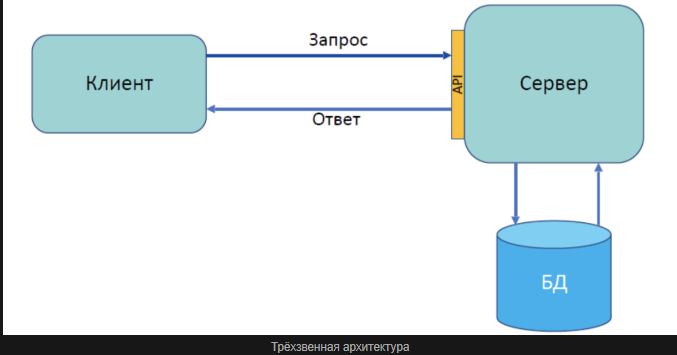
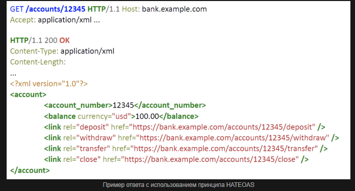
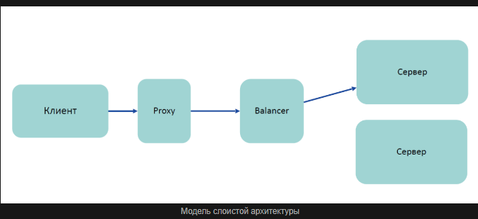

[Representational State Transfer](https://habr.com/ru/articles/590679/) — это архитектурный стиль взаимодействия компонентов распределённого приложения в сети. Архитектурный стиль – это набор согласованных ограничений и принципов проектирования, позволяющий добиться определённых свойств системы.

Если мы обратимся опять же к первоисточнику — к работе Филдинга, то мы выясним, что назначение REST в том, чтобы придать проектируемой системе такие ***свойства*** как:

- Производительность,
- Масштабируемость,
- Гибкость к изменениям,
- Отказоустойчивость,
- Простота поддержки.

### 6 принципов REST:

1. Клиент-серверная архитектура
2. Stateless
3. Кэширование
4. Единообразие интерфейса
5. Layered system
6. Code on demand

### Принцип 1. Клиент-серверная архитектура
Сама концепция клиент-серверной архитектуры заключается в разделении некоторых зон ответственности: в разделении функций клиента и сервера.

- Клиент-серверная архитектура позволяет добиться масштабируемости.

### Принцип 2. Stateless
Принцип заключается в том, что сервер не должен хранить у себя информацию о сессии с клиентом. Он должен в каждом запросе получать всю информацию для обработки.
Почему в REST-архитектуре мы должны использовать именно Statless-подход?

#### Какие он даёт плюсы?
- Масштабируемость сервера,
- Уменьшение времени обработки запроса,
- Простота поддержки,
- Возможность использовать кэширование.

#### Какие проблемы может создать Stateless-подход?

- Усложнение логики клиента (именно на стороне клиента нам нужно хранить всю информацию о состоянии, о допустимых действиях, о недопустимых действиях и подобных вещах).
- Увеличение нагрузки на сеть (каждый раз мы передаём всю информацию, весь контекст. Таким образом, больше информации гоняем по сети).

### Принцип 3. Кэширование
принцип говорит нам о том, что каждый ответ сервера должен иметь пометку, можно ли его кэшировать.

#### Какие у кэширования плюсы?

- Уменьшение количества сетевых взаимодействий.
- Уменьшение нагрузки на системы (не грузим их дополнительными запросами).

### Принцип 4. Единообразие интерфейса. HATEOAS
Hypermedia as the Engine of Application State (HATEOAS) — одно из ограничений REST, согласно которому сервер возвращает не только ресурс, но и его связи с другими ресурсами и действия, которые можно с ним совершить.

Без использования HATEOAS

с использованием принципа HATEOAS

- ***Главный плюс*** этого подхода — клиент становится очень гибким в плане изменений на сервере с точки зрения изменения допустимых действий, изменения модели данных и т.д.

- В ***качестве обратной стороны*** медали мы получаем сильное усложнение логики, в первую очередь, клиента. Это может потянуть за собой и усложнение логики на сервере, потому что такие ответы нужно правильно формировать. Фактически ответственность за действия, которые совершает клиент, мы передаём на его же сторону. Мы ослабляем контроль валидности совершаемых операций на стороне сервера.

### Принцип 5. Layered system (слоистая архитектура)
Концепция слоистой архитектуры заключается в том, что ни клиент, ни сервер не должны знать о том, как происходит цепочка вызовов дальше своих прямых соседей.

Знания балансировщика в этой схеме об участниках конкретно этой цепочки вызовов должны заканчиваться proxy-сервером слева и сервером справа. О клиенте он уже ничего не знает.

Если изменяется поведение proxy-сервера (балансировщика, роутера или чего-то ещё), это не должно повлечь изменения для клиентского приложения или для сервера. Помещая их в эту цепочку вызовов, мы не должны замечать никакой разницы. Это позволяет нам изменять общую архитектуру без доработок на стороне клиента или сервера.

***Минусы***:

- Увеличение нагрузки на сеть (больше участников и больше вызовов, чем если бы мы шли один раз от клиента до сервера напрямую).
- Увеличение времени получения ответа (из-за появления дополнительных участников).

### Принцип 6. Code on done (код по требованию)
Идея передачи некоторого исполняемого кода (по сути какой-то программы) от сервера клиенту.

###  Наиболее частые заблуждения, которые вы можете встретить относительно концепции REST.

#### 1. Ограничения REST опциональны (необязательны)
С точки зрения создателя этой концепции существует ровно одно необязательное ограничение — код по требованию. Все остальные ограничения должны выполняться. Если одно из них не выполняется — это уже не REST-подход.

#### 2. REST — протокол передачи данных
REST — это не протокол передачи данных. Он не определяет правила о том, как мы должны передавать запросы, какая у них должна быть структура, что мы должны возвращать в ошибках. Единственное, что косвенно можно было бы приписать — это указание на то, что каждый ответ сервера должен содержать информацию о том, можно ли его кэшировать.

Но, в целом, REST — это концепция, парадигма, но не протокол. В отличие от HTTP, который действительно является протоколом.

#### 3. REST — это всегда HTTP

С одной стороны, ни один из архитектурных принципов REST не говорит нам о том, какой транспорт мы должны использовать — HTTP или очереди.

Почему же все считают, что REST — это HTTP? Здесь нужно сделать ремарку, что одним из главных авторов протокола HTTP — это Рэй Филдинг, автор концепции REST. Рэй Филдинг стремился спроектировать HTTP так, чтобы с помощью него концепцию REST было максимально удобно реализовывать.

#### 4. REST — это обязательно JSON

##  Рекомендуемые ссылки

1. Способы описания API
- https://swagger.io/specification/
- https://raml.org

2. Инструменты для тестирования API
- https://www.postman.com
- https://www.soapui.org

3. Большой список открытых API
- https://github.com/docops-hq/learnapidoc-ru/blob/m...

4. Ещё открытые API

- https://jsonplaceholder.typicode.com
- https://dadata.ru/api/
- https://coda.io/developers/apis/v1
- https://developer.kontur.ru/doc/focus?about=2