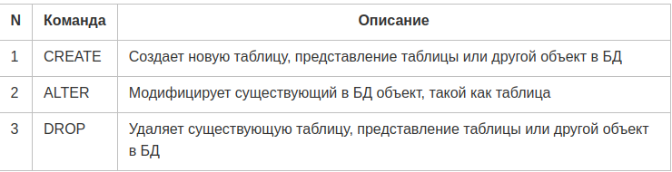
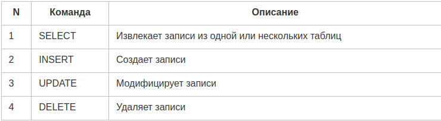
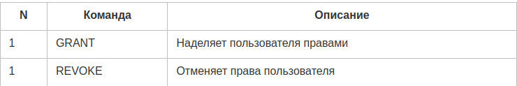
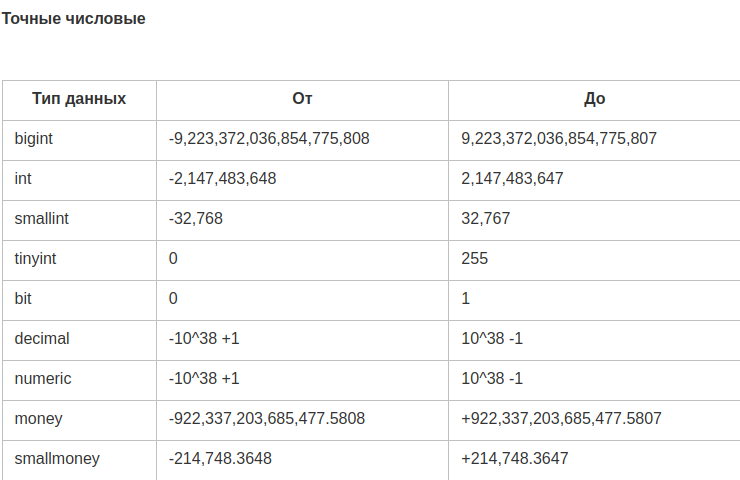
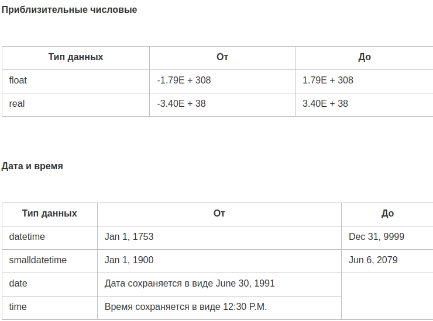
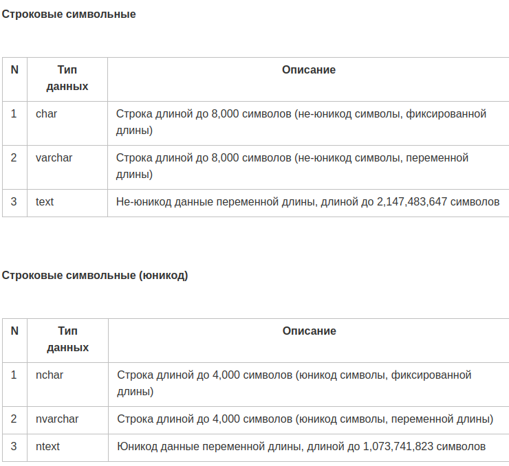
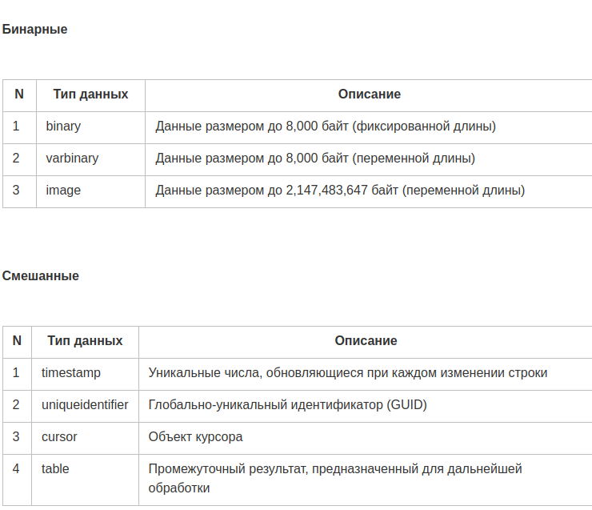
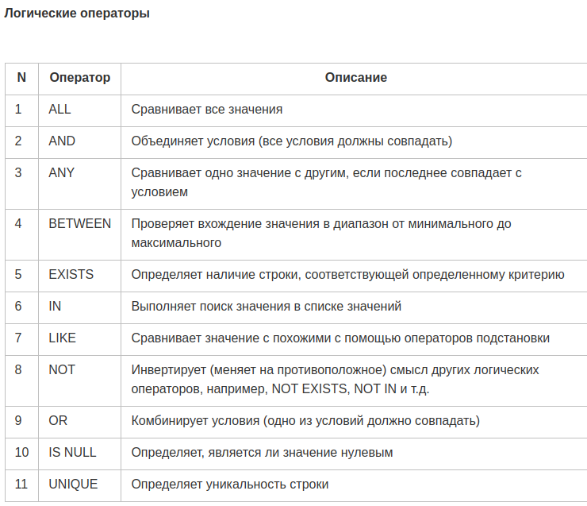

# SQL

`SQL` — это язык структурированных запросов (Structured Query Language), позволяющий хранить, манипулировать и извлекать данные из реляционных баз данных (далее — РБД, БД).

### SQL позволяет:

- получать доступ к данным в системах управления РБД
- описывать данные (их структуру)
- определять данные в БД и управлять ими
- взаимодействовать с другими языками через модули SQL, библиотеки и предваритальные компиляторы
- создавать и удалять БД и таблицы
- создавать представления, хранимые процедуры (stored procedures) и функции в БД
- устанавливать разрешения на доступ к таблицам, процедурам и представлениям

## Процесс SQL

При выполнении любой SQL-команды в любой RDBMS (Relational Database Management System — система управления РБД, СУБД, например, PostgreSQL, MySQL, MSSQL, SQLite и др.) система определяет наилучший способ выполнения запроса, а движок SQL определяет способ интерпретации задачи.

В данном процессе участвует несколького компонентов:

диспетчер запросов (Query Dispatcher)
движок оптимизации (Optimization Engines)
классический движок запросов (Classic Query Engine)
движок запросов SQL (SQL Query Engine) и т.д.

## Команды SQL

Стандартными командами для взаимодействия с РБД являются `CREATE, SELECT, INSERT, UPDATE, DELETE и DROP`. Эти команды могут быть классифицированы следующим образом:

#### DDL — язык определения данных (Data Definition Language)

#### DML — язык изменения данных (Data Manipulation Language)

### DCL — язык управления данными (Data Control Language)

Обратите внимание: использование верхнего регистра в названиях команд SQL — это всего лишь соглашение, большинство СУБД нечувствительны к регистру. Тем не менее, форма записи инструкций, когда названия команд пишутся большими буквами, а названия таблиц, колонок и др. — маленькими, позволяет быстро определять назначение производимой с данными операции.

## Что такое таблица?
Данные в СУБД хранятся в объектах БД, называемых таблицами (tables). Таблица, как правило, представляет собой коллекцию связанных между собой данных и состоит из определенного количества колонок и строк.

Таблица — это самая распространенная и простая форма хранения данных в РБД.

## Что такое запись или строка?

Запись или строка (record/row) — это любое единичное вхождение (entry), существующее в таблице.

## Ограничения

Ограничения (constraints) — это правила, применяемые к данным. Они используются для ограничения данных, которые могут быть записаны в таблицу. Это обеспечивает точность и достоверность данных в БД.

Ограничения могут устанавливаться как на уровне колонки, так и на уровне таблицы.

Среди наиболее распространенных ограничений можно назвать следующие:

- `NOT NULL` — колонка не может иметь нулевое значение
- `DEFAULT` — значение колонки по умолчанию
- `UNIQUE` — все значения колонки должны быть уникальными
- `PRIMARY KEY` — первичный или основной ключ, уникальный идентификатор записи в текущей таблице
- `FOREIGN KEY `— внешний ключ, уникальный идентификатор записи в другой таблице (таблице, связанной с текущей)
- `CHECK` — все значения в колонке должны удовлетворять определенному условию
- `INDEX` — быстрая запись и извлечение данных

Любое ограничение может быть удалено с помощью команды `ALTER TABLE` и `DROP CONSTRAINT` + название ограничения. Некоторые реализации предоставляют сокращения для удаления ограничений и возможность отключать ограничения вместо их удаления.

## Целостность данных

В каждой СУБД существуют следующие категории целостности данных:

- `целостность объекта (Entity Integrity)` — в таблице не должно быть дубликатов (двух и более строк с одинаковыми значениями)
- `целостность домена (Domain Integrity) `— фильтрация значений по типу, формату или диапазону
- `целостность ссылок (Referential integrity)` — строки, используемые другими записями (строки, на которые в других записях имеются ссылки), не могут быть удалены
- `целостность, определенная пользователем (User-Defined Integrity)` — дополнительные правила

## Нормализация БД

Нормализация — это процесс эффективной организации данных в БД. Существует две главных причины, обуславливающих необходимость нормализации:

- предотвращение записи в БД лишних данных, например, хранения одинаковых данных в разных таблицах
- обеспечение "оправданной" связи между данными

Нормализация предполагает соблюдение нескольких форм. Форма — это формат структурирования БД.

### Первая нормальная форма
`В базе данных не должно быть дубликатов и составных данных.`

### Вторая нормальная форма
`у каждой записи в базе данных должен быть первичный ключ. Первичный ключ — это элемент записи, который не повторяется в других записях.`

### Третья нормальная форма
`В записи не должно быть столбцов с неключевыми значениями, которые зависят от других неключевых значений.`

## Типы данных

Каждая колонка, переменная и выражение в SQL имеют определенный тип данных (data type). Основные категории типов данных:

## Операторы
