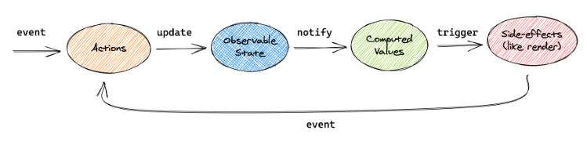
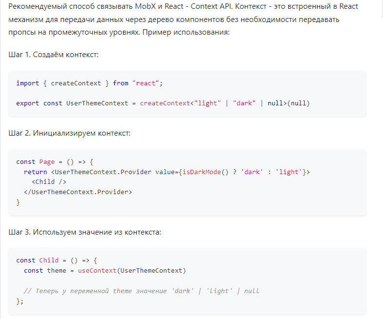
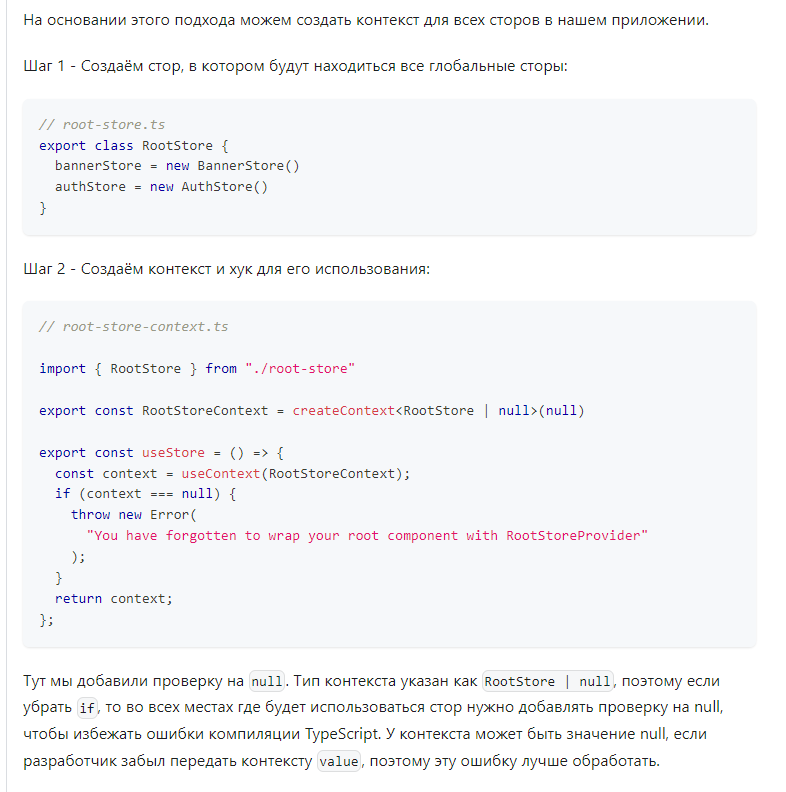
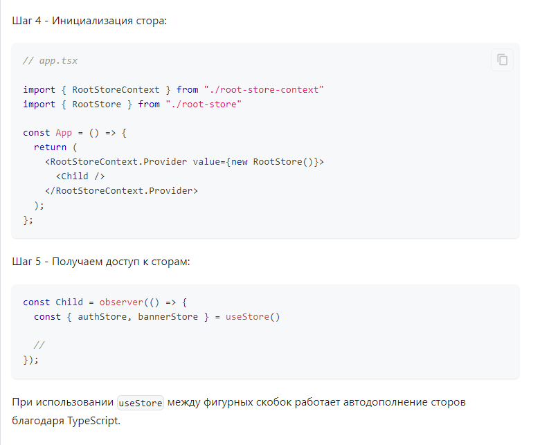
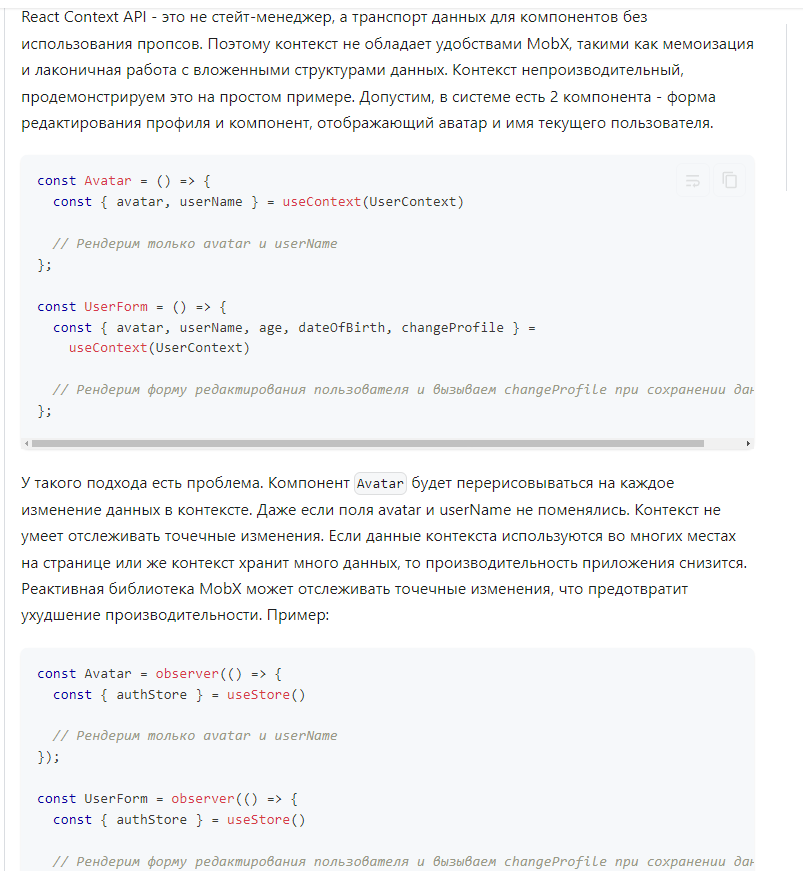

# Наблюдаемое состояние



- Из внешней среды к нам прилетают события (events), например клики мыши, пользовательский ввод, тики таймера и т.д.
- Экшены (actions) это функции, которые мутируют (обновляют) наблюдаемые поля.
- Сумма наблюдаемых полей (observable state) это стейт нашего приложения.
- Изменение стейта приводит к обновлению вычисляемых значений (computed values) и к побочным эффектам (side-effects), которые мы будем называть реакциями.

 Чтобы реактивность работала, в конструкторе класса необходимо вызвать MobX-функцию makeObservable и передать в нее сам класс и карту аннотаций вторым аргументом.

```javascript
 constructor() {
    makeObservable(this, {
      count: observable,
      inc: action,
      dec: action,
      double: computed,
    })
  }
```


`Computed` это `вычисляемые из стейта значения`, т.е. это чистая функция, которая возвращает производную от нашего состояния. Одна из особенностей computed заключается в том, что `он запоминает вычисленный результат`. То есть, когда вычисление завершено,` MobX сравнивает новый результат с предыдущим`. Если результат `совпадает`, то `уведомление` наблюдателям `не будет отправлено`.

`makeAutoObservable` автоматически помечает все поля класса как наблюдаемые. Все методы класса помечаются как экшены, а все геттеры как computed.

# Реакции

Реакции похожи на computed, за исключением того, что `computed возвращает новое значение`, а `реакции являются побочным эффектом изменения состояния и никакого нового значения не возвращают`. Вывод в консоль, выполнение сетевых запросов, обновление React-дерева - все это пример реакций.

`observer` автоматически подписывает React-компонент на любые наблюдаемые поля, которые используются во время рендеринга.

### MobX не подписывается на изменения значений, он отслеживает доступ к свойствам объекта.
Когда вы считываете поле `count` внутри `observer`, сам `observer` запоминает тот факт, что вы использовали поле count в теле его функции. Другими словами,` самого чтения поля достаточно, чтобы observer` (или любая другая реакция), `знали`, что они `зависят от этого поля и что за ним нужно следить`.

# Actions

MobX не обязывает вас изменять наблюдаемые поля именно внутри экшенов. Вы можете мутировать стейт откуда угодно, из любой части вашего приложения, хоть это и `не рекомендовано`.

Если мы откроем консоль, то увидим что MobX выдает предупреждение:
```
[MobX] Since strict-mode is enabled, changing (observed) observable values without using an action is not allowed. Tried to modify: Store@1.count
```

В строгом режиме (включён по умолчанию в Mobx 6) `изменение наблюдаемых значений без использования экшенов не допускается`. Это предупреждение мы `получим в рантайме`. Чтобы отлавливать такие ошибки на этапе компиляции, мы могли бы пометить наше `поле` как `приватное`.

# Асинхронные действия

### Объединение обновлений

```js
import { makeAutoObservable } from 'mobx'

class Store {
  count = 0

  constructor() {
    makeAutoObservable(this)
  }

  inc = () => {
    this.count++
    this.count++
    this.count++
  }

  dec = () => {
    this.count--
  }
}

export const counterStore = new Store()
```
Если вы откроете консоль и нажмете на кнопку "+", то увидите что реакция запустилась всего лишь один раз, несмотря на то, что мы трижды мутировали count. `Потому что промежуточные состояния не видны наблюдателям. MobX просто копит эти изменения и откладывает уведомление подписчиков до завершения блока транзакции.`

### логика ломается если добавить асинхронные действия в наш экшн

```js
import { makeAutoObservable } from 'mobx'

const delay = (ms: number) => new Promise((_) => setTimeout(_, ms))

class Store {
  count = 0

  constructor() {
    makeAutoObservable(this)
  }

  inc = async () => {
    await delay(10)
    this.count++
    this.count++
    this.count++
  }

  dec = () => {
    this.count--
  }
}

export const counterStore = new Store()
```

Механизм объединение обновлений MobX нарушается, потому что мы "окрасили" нашу асинхронную функцию. Запустив из `какой-то точки синхронного выполнения асинхронный код `— вы уже `не сможете из асинхронного кода вернуться к точке вызова`. То есть `любые шаги после await не находятся в том же тике.`

## runInAction
Чтобы исправить это поведение, можно использовать функцию runInAction из пакета mobx.

```js
inc = async () => {
  await delay(10)
  runInAction(() => {
    this.count++
    this.count++
    this.count++
  })
}
```
Проблема решена, но каждый раз оборачивать код в runInAction может быть утомительным. Есть несколько альтернативных решений этой проблемы.

## setTimeout планировщика реакций
MobX позволяет конфигурировать поведение планировщика реакций. По умолчанию `reactionScheduler` просто запускает реакцию f без какого-либо другого поведения:

```js
import { configure } from 'mobx'

configure({
  reactionScheduler: (f) => {
    f()
  },
})
```

Настройка `reactionScheduler` может быть полезна для логирования или отладки. Кроме того, с помощью setTimeout мы можем `отложить выполнение реакций`:

```js
configure({
  enforceActions: 'never',
  reactionScheduler: (f) => setTimeout(f),
})
```

`планировщик будет откладывать реакции до тех пор`, `пока все ваши синхронные изменения не закончатся`. То есть мы таких образом` накапливаем изменения`, `ждем` их `завершения` и потом `вызываем реакции на эти изменения`. Подобный трюк позволяет нам отказаться от `runInAction` и от использования flow-генераторов вместо async / await.

Вместе с тем нужно понимать, что е`сли какой-то сторонний код аналогично откладывает задачи с помощью setTimeout`, вместо того, чтобы выполнять их сразу, то `порядок обработки становится непредсказуемым и могут возникать трудновоспроизводимые ошибки`. В частности, из опыта авторов, `отложенный reactionScheduler` `нарушает работу библиотеки pusher-js и создает проблемы в среде React Native.`

`Официальная позиция Mobx - не использовать подобные трюки, а вместо этого использовать runInAction или генераторы.`

## Генераторы
Другой способ избежать проблемы - использовать генераторы:

```js
import { makeAutoObservable } from 'mobx'

const delay = (ms: number) => new Promise((_) => setTimeout(_, ms))

class Store {
  count = 0

  constructor() {
    makeAutoObservable(this)
  }

  *inc() {
    yield delay(10)
    this.count++
    this.count++
    this.count++
  }

  dec() {
    this.count--
  }
}

export const counterStore = new Store()
```
Этот подход является наиболее чистым, так как не влияет ни на вложенность кода, ни на планировщик реакций. Однако у него есть ряд сложностей с типизацией.

# Избавляемся от бойлерплейта (шаблоннного кода) в API-слое

При работе с API часто возникает необходимость описывать запросы к API, обрабатывать ошибки и состояния загрузки. В экосистеме Mobx нет аналога react-query, но базовый функционал можно построить с использованием официального пакета `mobx-utils`.

# Доступ к состоянию в компонентах

Существуют различные способы предоставить компонентам доступ к MobX сторам. В данном разделе мы рассмотрим основные способы на примере простого стора, отвечающего за отображение баннера на сайте.

1) `Импорт из модуля`

2) `React Context API`

`Существует третий способ - функция inject`. Этот `подход является устаревшим` и рассматриваться в книге не будет. Эта функция не была включена в mobx-react-lite, так как вместо неё можно использовать хук useContext из React Context API.

## Синглтон
Движок JS позволяет создать синглтон - объект, существующий в единственном экземпляре на всё приложение. Экземпляр доступен из любого места приложения и предоставляет общий доступ к состоянию для всех компонентов, где будет использоваться. Пример:

```js
class BannerStore {
  isOpen = false

  constructor() {
    makeAutoObservable(this)
  }

  open() {
    this.isOpen = true
  }

  close() {
    this.isOpen = false
  }
}

export const bannerStore = new BannerStore()
```

Подключаем его к компоненту:
```js
import { bannerStore } from "./banner-store";

export const Page = observer(() => {
  return (
    <div>
      {bannerStore.isOpen && <Banner />}
      ...
    </div>
  );
})
```

## SSR
Если запустить сервер на Node.js, то каждый модуль будет проинициализирован ровно один раз. Если создать синглтон с помощью экспорта из модуля, то состояние стора будет общим для всех пользователей одновременно. Стор создаётся один раз на время жизни сервера и состояние стора становится общим для всех запросов. Пример:

```
-- Запрос 1 - Алиса запрашивает главную страницу
  -- на сервере Алиса проходит аутентификацию.
    -- В AuthStore флаг isLoggedIn меняется на true, а observable поле user меняется на { name: 'Alice' }

-- Запрос 2 - Анонимный пользователь запрашивает главную страницу
  -- сервер отдаёт страницу с залогиненным пользователем Алисой
```
Это неправильное поведение. Поэтому в SSR-окружении сторы должны создаваться на каждый запрос. Подробнее работа с SSR рассмотрена в отдельной главе.

## Тестирование
Так как стор является синглтоном, то его состояние будет общим для всех тестовых сценариев. Например, вы хотите протестировать React-компонент, использующий BannerStore. Пример сценария - баннер по умолчанию закрыт, но пользователь может его открыть после нажатия на кнопку.

Но если мы хотим написать ещё один сценарий возникнет неожиданная проблема - после рендера баннер будет открыт. Он остался открытым после предыдущего теста. Хорошая практика при написании тестов - каждый тест должен быть независимым. Тесты не должны влиять друг на друга, это позволит быстрее обнаружить проблему когда тесты упадут и нужно будет выяснять причину. Для того чтобы в каждом теста предусловия были одинаковые мы можем добавить метод `reset` в BannerStore:

```
class BannerStore {
  ...
+  reset() {
+    this.isOpen = false
+  }
}
```
Этот метод можно вызывать в начале каждого теста:

Но в таком случае повышается риск человеческой ошибки. У каждого стора должен быть метод reset, а в этот метод каждый раз нужно будет добавлять новые поля для восстановления изначального значения.

## React Context API







## Зачем MobX если есть контекст?



## Если контекст непроизводительный, то ухудшает ли он производительность в связке с MobX?

`Нет`. Контекст приводит к лишним перерисовкам компонентов только если значение контекста меняется. Точнее - если `объект внутри контекста пересоздаётся`. `Сторы MobX внутри контекста не будут пересоздаваться, ссылки на сторы будут оставаться прежними на протяжении всей жизни приложения`, а потому их изменение не будет приводить к нежелательным перерисовкам компонентов.

```
Мы рассмотрели разные способы связывания React-компонентов и Mobx-сторов. Синглтон - самый простой способ. Если приложению нужен SSR, то рекомендуемый подход - Context API.
```